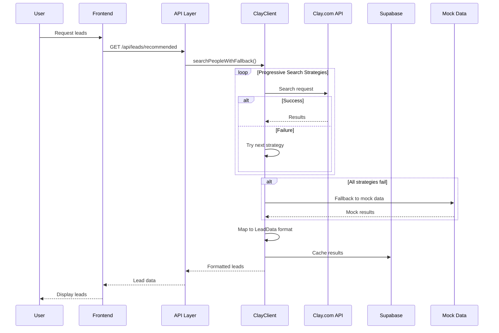
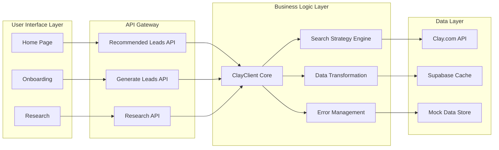
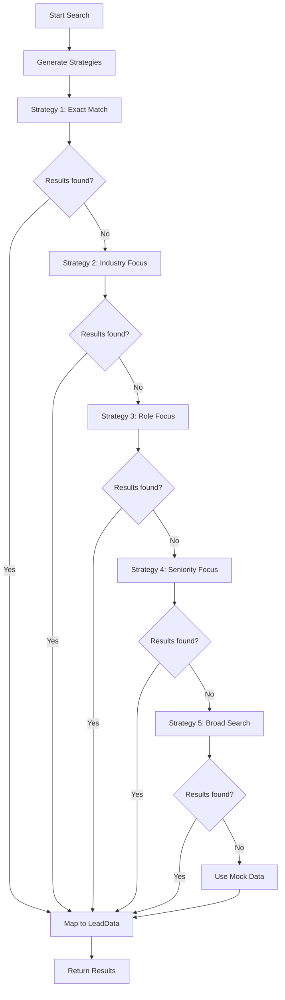
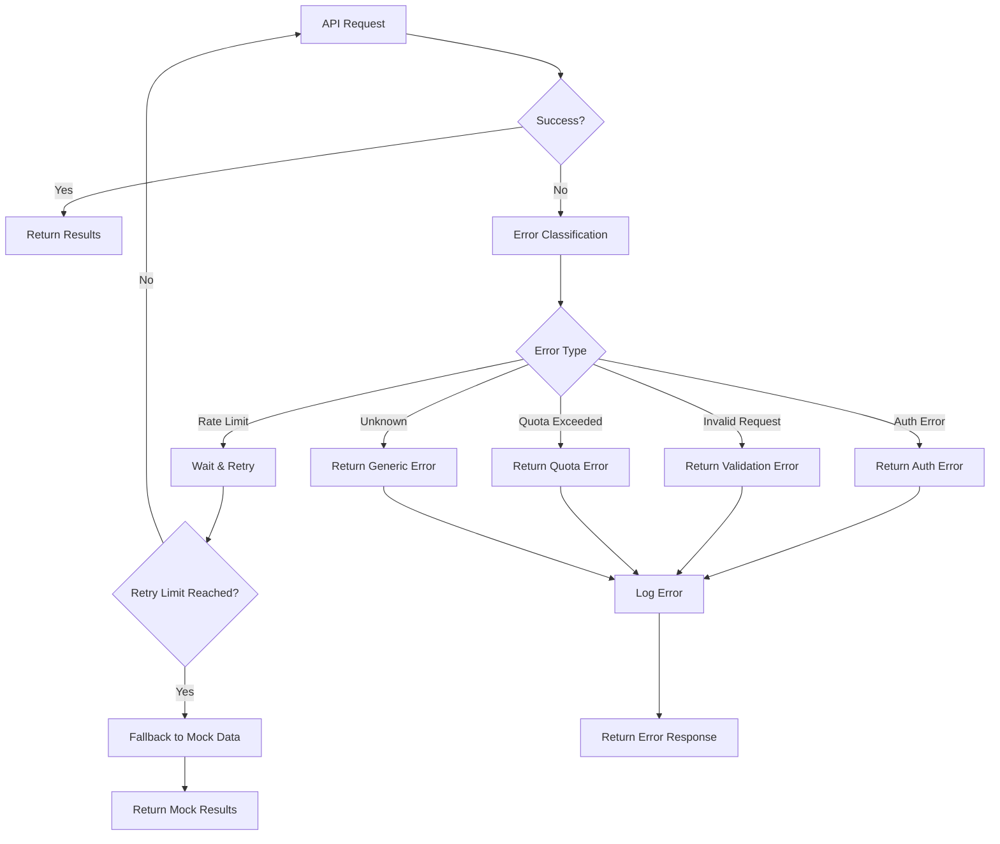
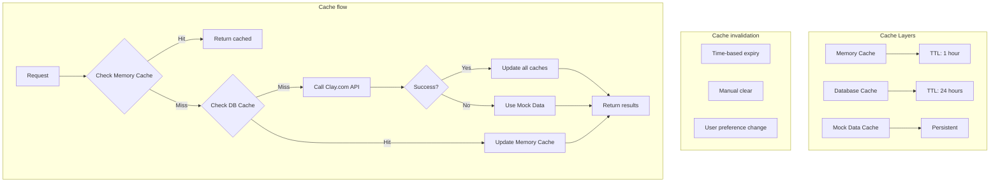
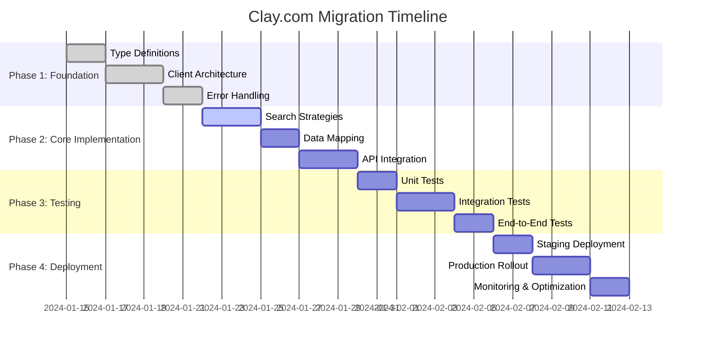

# Clay.com Integration Architecture

## System Architecture Overview

```mermaid
graph TB
    subgraph "Frontend Components"
        A[Home Page] --> B[RecommendedLeadsWidget]
        C[Onboarding Quick Win] --> D[Lead Generation]
        E[Research Page] --> F[Lead Details]
    end

    subgraph "API Layer"
        G[/api/leads/recommended] --> H[ClayClient]
        I[/api/leads/generate] --> H
        J[/api/research/leads] --> H
    end

    subgraph "Clay.com Integration"
        H --> K[Search Strategies]
        H --> L[Data Mapper]
        H --> M[Error Handler]
        H --> N[Rate Limiter]
        H --> O[Cache Manager]
    end

    subgraph "External Services"
        P[Clay.com API]
        Q[Supabase Database]
        R[Mock Data Service]
    end

    subgraph "Data Flow"
        K --> P
        L --> Q
        M --> R
        N --> P
        O --> Q
    end

    B --> G
    D --> I
    F --> J
```

## Data Flow Architecture



## Component Interaction Diagram



## Search Strategy Flow



## Error Handling Flow



## Caching Strategy



## Migration Strategy Timeline



## Technology Stack

### Frontend Components
- **Next.js 14** - React framework
- **TypeScript** - Type safety
- **Tailwind CSS** - Styling
- **Lucide React** - Icons

### Backend Services
- **Next.js API Routes** - Server-side logic
- **Supabase** - Database and caching
- **Clay.com API** - Lead generation service

### Development Tools
- **ESLint** - Code linting
- **Prettier** - Code formatting
- **Jest** - Testing framework
- **Mermaid** - Diagram generation

## Performance Considerations

### Response Time Targets
- **API Response**: < 2 seconds
- **Cache Hit**: < 100ms
- **Mock Data**: < 50ms
- **Error Response**: < 500ms

### Rate Limiting Strategy
- **Clay.com API**: 60 requests/minute
- **User Rate Limit**: 1 request/30 seconds
- **Burst Handling**: 5 requests max

### Caching Strategy
- **Memory Cache**: 1 hour TTL
- **Database Cache**: 24 hour TTL
- **Cache Invalidation**: Manual + Time-based

## Security Considerations

### API Key Management
- Environment variable storage
- Server-side only access
- Regular key rotation

### Data Privacy
- No PII in logs
- Secure data transmission
- GDPR compliance

### Error Handling
- No sensitive data in error messages
- Graceful degradation
- User-friendly error messages

## Monitoring & Observability

### Key Metrics
- API response times
- Error rates by type
- Cache hit ratios
- User satisfaction scores

### Logging Strategy
- Structured logging
- Error correlation IDs
- Performance metrics
- User interaction tracking

### Alerting
- High error rate alerts
- Performance degradation
- API quota warnings
- Service availability

---

This architecture provides a robust foundation for integrating Clay.com API while maintaining high performance, reliability, and user experience standards.